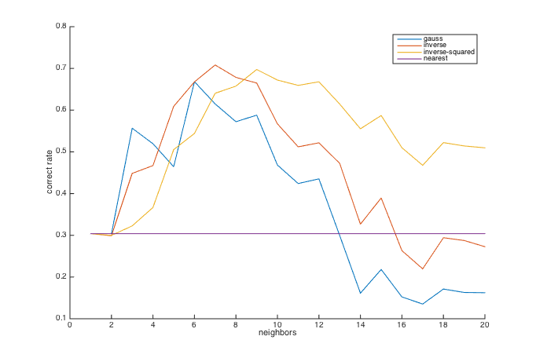
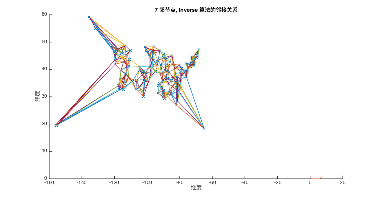

% 基于空间插值算法的气温异常检验
% 无36
  李思涵
  2013011187
  <lisihan969@gmail.com>
% \today

# 介绍

由于和生化过程，物理过程都有着十分密切的联系，气温一直是环境模型中最重要的参数之一。由于气温数据
通常是通过有限的测量点得到，气温空间插值一直是一个被关注的问题。不同的研究对海拔，一年中不同的
月份等种种原因做了系统了全面的分析，并提出了很多不同的算法。[1] 对气温插值算法进行了一个系统而
全面的总结。

然而，需要注意的是，尽管这些气温插值算法的目标是给出一个区域内的温度分布，在实际的研究中，算法的
正确率是通过交叉验证来进行的。也就是说，实验中会每次排除一个点的气温测量值，用其他点的测量值进行
预测，并对比预测值和实际值。这和我们的对异常气温的检测异曲同工。

所以在这里我们使用 [1] 中提出的四种气温插值模型（Gauss, Inverse, Inverse-squared,
Nearest），进行异常值的检验。具体方法则是将预测误差的绝对值按各气象站归一化之后，取出最大的
一项，即为我们预测的出错项。

# 源代码

## cal_dis

```matlab
function dis = cal_dis(pos)
    R = 6.371;

    len = length(pos);
    dis = zeros(len);

    for k1 = 1:len-1
        for k2 = k1+1:len
            aa = pos(k1, 1) / 180 * pi;
            ba = pos(k1, 2) / 180 * pi;
            ab = pos(k2, 1) / 180 * pi;
            bb = pos(k2, 2) / 180 * pi;
            dis(k1, k2) = ...
                R * acos(cos(aa - ab) * cos(ba) * cos(bb) + sin(ba) * sin(bb));
        end
    end

    dis = dis + dis';
end
```

## cal_adj_mat

```matlab
% Connect k-nearest neighbors.
function adj_mat = cal_adj_mat(dis, k, method)
    len = size(dis, 1);

    if strcmp(method, 'nearest')
        k = 1;
    end

    % Keep k entries for each row.
    for row = 1:len
        this_row = dis(row, :);
        sorted = sort(this_row);
        % Note that sorted(1) is always 0, that is distance to self.
        this_row(this_row > sorted(k + 1)) = 0;
        dis(row, :) = this_row;
    end

    switch method
    case 'nearest'
        adj_mat = dis;
    case 'gauss'
        adj_mat = exp(-dis.^2);
    case 'inverse'
        adj_mat = 1 ./ dis;
    case 'inverse-squared'
        adj_mat = 1 ./ (dis.^2);
    end

    adj_mat(dis == 0) = 0;

    row_sum = sum(adj_mat, 2);
    adj_mat = adj_mat ./ repmat(row_sum, [1 len]);
end
```

## draw_adj_mat

```matlab
function count = draw_adj_mat(data, adj_mat)
    count = 0;
    len = size(adj_mat, 1);
    figure
    hold on
    plot(data(:, end), data(:, end-1), 'x')
    for k1=1:len
        for k2=1:len
            if adj_mat(k1, k2)
                plot(data([k1; k2], end), data([k1; k2], end-1));
                count = count + 1;
            end
        end
    end
end
```

## find_err

```
function [station, day] = find_err(adj_mat, temp)
    err = abs(adj_mat * temp - temp);
    err = err ./ repmat(sum(err, 2), [1 size(temp, 2)]);

    [~, index] = max(err(:));
    stations = size(temp, 1);
    station = mod(index - 1, stations) + 1;
    day = ceil(index / stations);
end
```

## run

```matlab
load '../data/data.mat'

dis = cal_dis(data(:, [end, end - 1]));

temp = data(:, 2:end-2);
stations = size(temp, 1);
days = size(temp, 2);

method = {'gauss'; 'inverse'; 'inverse-squared'; 'nearest'};

figure;
hold on

for k_method = 1:length(method)
    correct_rate = [];
    for neighbor = 1:20
        adj_mat = cal_adj_mat(dis, neighbor, method{k_method});

        correct = 0;
        for station = 1:stations
            for day = 1:days
                err_temp = temp;
                err_temp(station, day) = err_temp(station, day) + 20;
                [pred_station, pred_day] = find_err(adj_mat, err_temp);

                if pred_station == station && pred_day == day
                    correct = correct + 1;
                end
            end
        end

        correct_rate(neighbor) = correct / (stations * days);
    end
    plot(correct_rate);
end

legend(method);
xlabel neighbors
ylabel 'correct rate'
```

# 实验结果



从图中我们可以看出，当邻节点数目选取得较为合理时（2-12），Gauss, Inverse 和 Inverse-squared 算法都比最朴素的 Nearest 有效。其中，正确率最高的算法是邻节点为 7 时的 Inverse 算法，正确率为 70.8 %。此时的邻接关系如图所示。



# 参考文献

[1] Stahl K, Moore R D, Floyer J A, et al. Comparison of approaches for spatial interpolation of daily air temperature in a large region with complex topography and highly variable station density[J]. Agricultural and Forest Meteorology, 2006, 139(3): 224-236.
